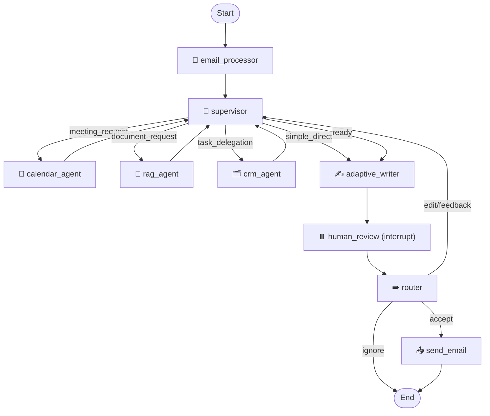

```mermaid
graph TD

    START([Start]) --> email_processor["📧 email_processor"]
    email_processor --> supervisor["🧭 supervisor"]

    %% Supervisor sends tasks to specialized agents
    supervisor -->|meeting_request| calendar_agent["📅 calendar_agent"]
    supervisor -->|document_request| rag_agent["📄 rag_agent"]
    supervisor -->|task_delegation| crm_agent["🗂️ crm_agent"]
    supervisor -->|simple_direct| adaptive_writer["✍️ adaptive_writer"]

    %% Specialized agents always return to supervisor
    calendar_agent --> supervisor
    rag_agent --> supervisor
    crm_agent --> supervisor

    %% Once all requirements are satisfied
    supervisor -->|ready| adaptive_writer

    %% Draft → Human-in-the-loop
    adaptive_writer --> human_review["⏸️ human_review (interrupt)"]
    human_review --> router["➡️ router"]

    router -->|accept| send_email["📤 send_email"]
    router -->|edit/feedback| supervisor
    router -->|ignore| END([End])

    send_email --> END
```

